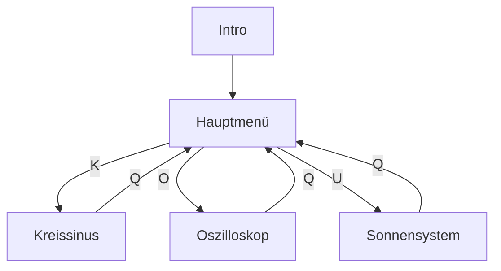

# THE PROJECT — Informatik 1995

Ein Schüler-Programmierprojekt aus dem Informatikunterricht, geschrieben 1995 von **Stefan Kriesel** und **Nico Winkler**.

## Das Projekt

Wir haben dieses Programm als Abschlussprojekt im Informatik-Unterricht in Turbo Pascal geschrieben — komplett mit BGI-Grafik, PC-Speaker-Tönen und allem, was damals dazugehörte.

Das Ergebnis: vier Programme in einem, präsentiert mit einem kleinen Intro und einem Hauptmenü.

### Die Programme

| Taste | Programm | Beschreibung |
|-------|----------|--------------|
| **K** | Kreissinus | Visualisiert Sinus- und Kosinuswellen, animiert mit einem rotierenden Punkt auf einem Kreis |
| **O** | Oszilloskop | Ein digitales Oszilloskop — Periode und Amplitude einstellbar, mit PC-Speaker-Ton |
| **U** | Sonnensystem | Das Sonnensystem mit allen 6 Planeten, Monden, Saturnringen und Infotabelle |
| **Q** | Zurück | Zurück zum Intro |

## Nach dem Projekt

Nachdem wir das Projekt fertig abgegeben hatten, durften wir den Rest des Schuljahres die Rechner frei nutzen. Es folgten viele schöne Stunden:

- **DOOM** im Netzwerk — der Computerraum als Schlachtfeld
- **F29 Retaliator** — Kampfjet-Simulator über den Wolken
- **Stunts** — Stunt-Rennstrecken bauen und mit viel zu hoher Geschwindigkeit durch Loopings fliegen

## Web-Version

Diese Website ist eine originalgetreue Nachbildung im Browser — Canvas statt BGI, Web Audio API statt PC-Speaker, aber dieselbe Logik, dieselben Farben und dasselbe Feeling wie 1995.

**Stefan Kriesel & Nico Winkler — (c) 1995 Informatik-Projekt**
